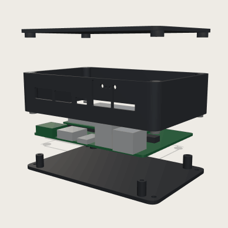

# Mallow enclosure

A 3D-printable case for the [Toradex Mallow](https://www.toradex.com/products/carrier-board/mallow-carrier-board) carrier board with a Verdin SoM and passive heatsink.

119 × 78 × 38 mm. Three printed parts, no fasteners visible from outside, cover held by magnets.

## What is here

| Path | What it is |
| --- | --- |
| `src/enclosure.html` | The model. Open it in a browser: orbit, toggle the exploded view, pick a part, download it as OBJ or GLB. |
| `src/fit-coupon.html` | A small test print — magnet-pocket gauge and one full-size corner — to check tolerances before committing to the full set. |
| `docs/build-sheet.html` | Assembly order, hardware list, board dimensions. Prints to A4. |
| `docs/drawings.html` | Dimensioned drawings of all three parts, 1:1 at A4 landscape. |
| `export/` | Ready-to-slice meshes: `shell`, `base-plate`, `top-cover`. |

The geometry is defined by named constants at the top of `src/enclosure.html`. Change a number, reload, re-export. Nothing is baked into the meshes that is not derived from those constants.

## Printing

| | |
| --- | --- |
| Material | PETG (any rigid filament works) |
| Orientation | all three parts base down |
| Supports | none |
| Wall thickness | 2.5 mm, rear panel 1.5 mm |
| Layer height | 0.2 mm |

The rear openings and the front windows bridge across their tops. Print `fit-coupon` first — it tells you which magnet-pocket diameter suits your printer.

## Hardware

| Item | Qty | Where |
| --- | --- | --- |
| M3 × 8 self-tapping | 4 | Base plate into the corner posts (Ø2.8 pilot) |
| M3 × 6 self-tapping | 4 | Board into the standoffs (Ø2.8 pilot) |
| Neodymium disc 5 × 2 mm | 8 | Four in the shell posts, four in the cover |
| Neodymium disc 10 × 2 mm | 4 | Optional, base underside, to mount on steel |

## Assembly

1. Glue the 5 × 2 magnets into the shell posts and cover posts. Check polarity with a spare disc before the glue sets.
2. Screw the shell to the base plate, four M3 up into the posts.
3. Drop the board in from the top and fix it with four M3 into the standoffs.
4. Set the cover on. It floats 3.5 mm above the wall on the magnets alone.

Full sequence with the drawings in `docs/`.

## Board dimensions this was cut from

Mallow V1.1 datasheet, section 4.1. Connector centres are measured from the board's left edge:
RJ45 14.20, USB-A stack 31.60, USB-C 48.99, HDMI 65.79, power terminal 85.29.
Board 100 × 72 × 1.6 mm, Ø3.2 mounting holes 3 mm in from each edge.

If your board revision differs, the openings are the first thing to check.

## Status

Printed and fitted. Known open points are in the issues.

## Licence

CERN-OHL-P v2 — see `LICENSE`. Permissive: use it, sell it, modify it, no obligation to publish your changes.

