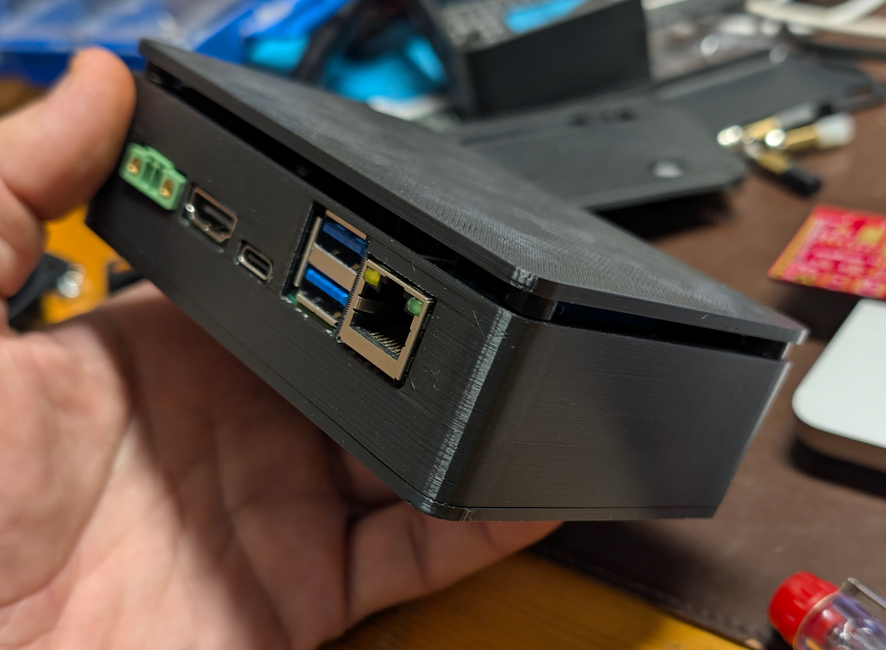

# toradex-mallow-enclosure

Parametric printable case for the Toradex Mallow — source, drawings and build sheet.

A 3D-printable enclosure for the [Toradex Mallow](https://www.toradex.com/products/carrier-board/mallow-carrier-board) carrier board carrying a Verdin SoM with a passive heatsink. 119 × 78 × 38 mm, three printed parts, no visible fasteners, magnetic lid.

**[Open the 3D model in your browser →](https://estebansannin.github.io/toradex-mallow-enclosure/)** — orbit it, lift the cover, download any part as OBJ or GLB.

## What is here

| Path | What it is |
| --- | --- |
| `src/enclosure.html` | The model. Open it in a browser: orbit, explode, pick a part, download it as OBJ or GLB. |
| `src/fit-coupon.html` | A small test print — magnet-pocket gauge and one full-size corner — to check tolerances before printing the set. |
| `docs/drawings.html` | Dimensioned drawings of all three parts. 1:1 at A4 landscape. |
| `docs/build-sheet.html` | Assembly order, hardware list, board dimensions. Prints to A4. |
| [`docs/DESIGN-LOG.md`](docs/DESIGN-LOG.md) | How the design got here: four printed revisions and what each one got wrong. |
| `standalone/` | Single-file copies. The two documents work fully offline; the two model files still fetch three.js from a CDN, so they need a connection. |

No meshes are committed. The geometry is parametric — the model exports the part you want, at the moment you want it, from the current source. See [CONTRIBUTING.md](CONTRIBUTING.md) to change a dimension.

## Printing

| | |
| --- | --- |
| Material | PETG, though any rigid filament works |
| Orientation | all three parts base down |
| Supports | none |
| Wall thickness | 2.5 mm, rear panel 1.5 mm |
| Layer height | 0.2 mm |

The rear openings and front windows bridge across their tops. Print the fit coupon first — it tells you which magnet-pocket diameter suits your printer.

## Hardware

| Item | Qty | Where |
| --- | --- | --- |
| M3 × 8 self-tapping | 4 | Base plate into the corner posts, Ø2.8 pilot |
| M3 × 6 self-tapping | 4 | Board into the standoffs, Ø2.8 pilot |
| Neodymium disc 5 × 2 mm | 8 | Four in the shell posts, four in the cover |
| Neodymium disc 10 × 2 mm | 4 | Optional, base underside, to mount on steel |

## Assembly

1. Glue the 5 × 2 magnets into the shell posts and the cover posts. Check the polarity of each pair with a spare disc before the glue sets.
2. Screw the shell to the base plate, four M3 up into the posts.
3. Drop the board in from the top and fix it with four M3 into the standoffs.
4. Set the cover on. It floats 3.5 mm above the wall on the magnets alone.

Full sequence and dimensions in `docs/`.

## Board dimensions this was cut from

Mallow V1.1 datasheet, section 4.1. Connector centres measured from the board's left edge: RJ45 14.20, USB-A stack 31.60, USB-C 48.99, HDMI 65.79, power terminal 85.29. Board 100 × 72 × 1.6 mm, Ø3.2 mounting holes 3 mm in from each edge.

If your board revision differs, the rear openings are the first thing to check.

## Status

Rev D is printed and fitted: the board goes in and the ports line up. Revisions A to C are not in this repository; what they taught is in [docs/DESIGN-LOG.md](docs/DESIGN-LOG.md).

## Licence

MIT — see [LICENSE](LICENSE).

